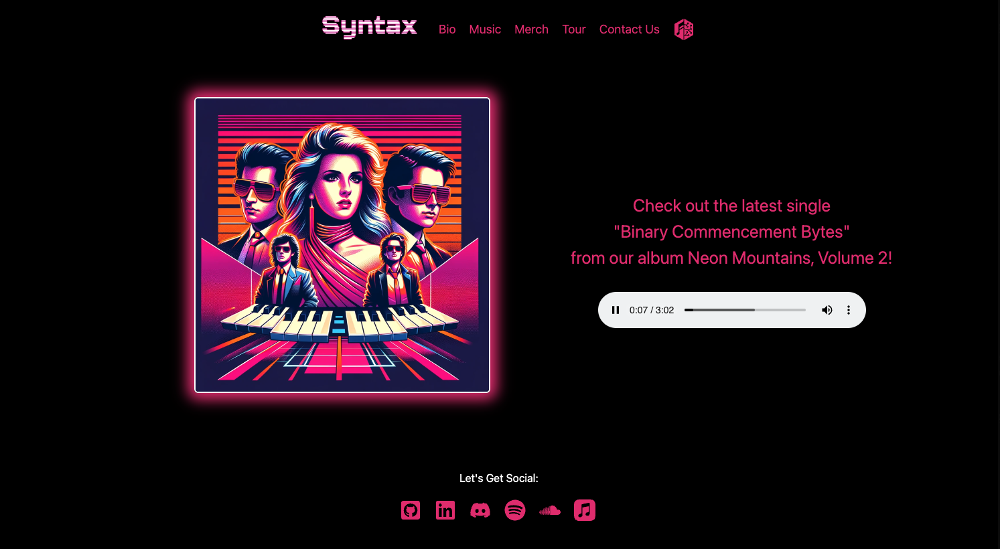

# Syntax



  ## Description
   This app is a website for a fictional 80’s synth band called Syntax. On this website you can see the band’s discography, view merch, look at tour dates, and contact the band through a contact page. Our goal was to make a template we could use ourselves and for potential clients in the future.

  ## Table of Contents
  - [Installation](#installation)
  - [Usage](#usage)
  - [Credits](#credits)
  - [License](#license)
  - [Features](#features)
  - [Contributing](#contibuting)
  - [Tests](#tests)
  - [Questions](#questions)

## Installation 
To install the application locally, follow these steps:

  1. Clone the [Syntax GitHub repository](https://github.com/grayd500/Syntax) to your local machine.
  2. Navigate to the directory in your command line interface.
  3. Open your preferred code editor and integrated terminal from the root of the local repository.
  4. Run the following commands:
  ```bash
      npm install
      npm run seed
      npm run develop
  ```
The app is now running in your local environment!

## Usage

  Syntax was created with a nostalgic vision of a fictional 80’s synth band, aiming to capture the essence of the era. The website allows users to immerse themselves in the band’s discography, explore unique merchandise, check upcoming tour dates, and connect with the band through a dedicated contact page.

Whether you're a fan of synth music or just curious about the creative concept, we invite you to experience the nostalgic vibes of Syntax. Visit the [Syntax Website](https://syntax-8rz6.onrender.com/) and explore the imaginary world of 80’s synth culture.

Feel free to share your thoughts, suggestions, or simply enjoy the retro atmosphere crafted within the Syntax project.

  ## Features
  - JavaScript
  - CSS (Tailwind, Material UI)
  - React + Vite
  - MongoDB
  - GraphQL
  - Node.js
  - express.js
  - Bcrypt.js
  - JSON Web Token
  - Full MERN Stack Application
  - Render hosting

## Contributing

We welcome contributions! If you want to help improve Syntax, here's how you can contribute:

1. **Reporting Issues:**
   - If you find bugs or have suggestions, open an issue on our [GitHub repository](https://github.com/your-username/syntax/issues).

2. **Feature Requests:**
   - Share your ideas for new features or improvements by opening a feature request on our [GitHub repository](https://github.com/your-username/syntax/issues).

3. **Pull Requests:**
   - Submit pull requests for code contributions. Follow our coding standards and test your changes.

  Thank you for helping make Syntax even better!


## Credits
  - ChatGPT for code snippets and README assistance
  - Coding Bootcamp at University of Texas at Austin via EdX
  
  ## License
  [](https://opensource.org/licenses/MIT)


## Questions

If you have any questions, feel free to contact us:

- **Cimarron Jenschke**
  - [LinkedIn](https://www.linkedin.com/in/cimarron-jenschke-a59ab5290/)
  - [GitHub](https://github.com/cjenschke)

- **Christi Tugwell**
  - [LinkedIn](https://www.linkedin.com/in/christi-tugwell-a67194104/)
  - [GitHub](https://github.com/tugwellchristi)

- **David Gray**
  - [LinkedIn](https://www.linkedin.com/in/grayd500)
  - [GitHub](https://github.com/grayd500)

- **Dale Haynie**
  - [LinkedIn](https://www.linkedin.com/in/dale-haynie-3b66142a7/)
  - [GitHub](https://github.com/Daleray1231)

- **Derek Modugno**
  - [LinkedIn](https://www.linkedin.com/in/derek-modugno-9927b72b1/)
  - [GitHub](https://github.com/derekm129)
